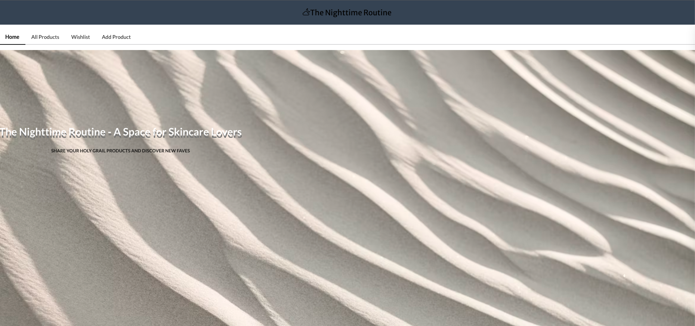
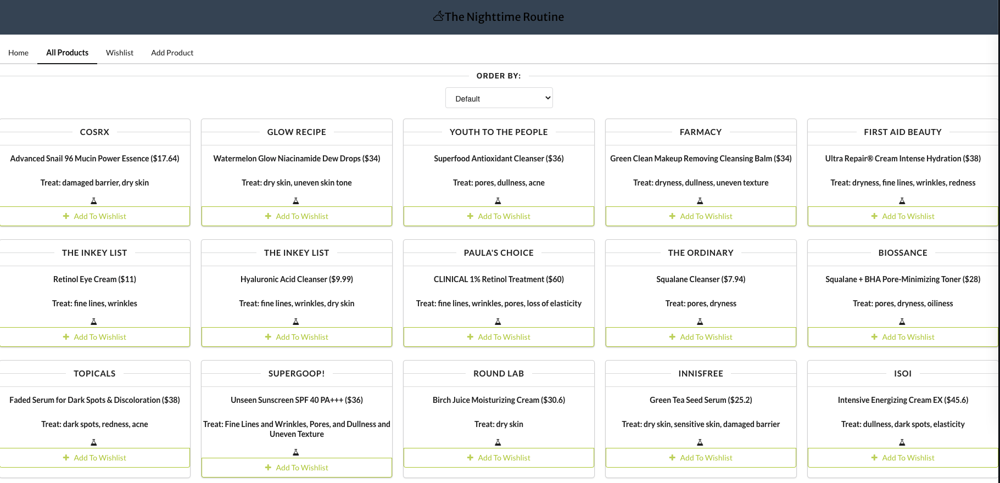
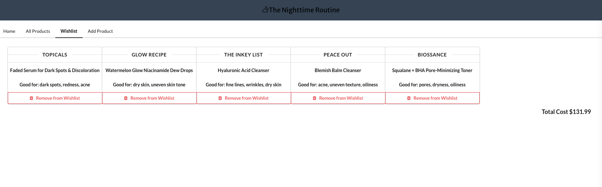
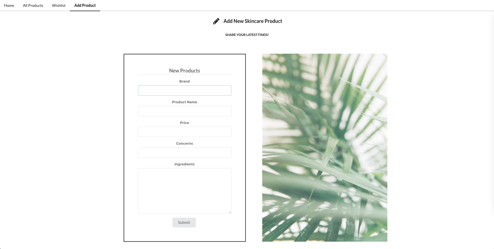

# The Nighttime Routine 
The Nighttime Routine is a space for skincare lovers to find and share products and plan future purchases with their own wishlist. This application's frontend was built with HTML, Javascript, React, CSS, and Semantic UI. After cloning, the frontend can be launched by running `npm install` to install necessary dependencies and `npm start` to launch the frontend server. 

## Backend
The backend of this applicaiton was built with Ruby and ActiveRecord and can be found [here](https://github.com/HannahGlazier/the-nighttime-routine-backend). After cloning, the backend can be launched by running `rake db:migrate` to set up the database, `rake db:seed` to install some initial seed data, `bundle install` to install necessary gems, and finally `bundle exec rake server` to launch the server.

## User Stories
Users are able to scroll (and sort) through various skincare products and view the product names, brands, prices, ingredients, claims/treatment concerns. Users are able to save these products to a wishlist and view the total price of their wishlist in order to plan for future purchases. Users are also able to add new products to the main product list. 

## Walkthrough Snapshots

### Homepage: 

### Product List:

### Wishlist:

### Add New Product: 

## Available Scripts

In the project directory, you can run:

### `npm start`

Runs the app in the development mode.\
Open [http://localhost:3000](http://localhost:3000) to view it in your browser.

The page will reload when you make changes.\
You may also see any lint errors in the console.

### `npm test`

Launches the test runner in the interactive watch mode.\
See the section about [running tests](https://facebook.github.io/create-react-app/docs/running-tests) for more information.

### `npm run build`

Builds the app for production to the `build` folder.\
It correctly bundles React in production mode and optimizes the build for the best performance.

The build is minified and the filenames include the hashes.\
Your app is ready to be deployed!

See the section about [deployment](https://facebook.github.io/create-react-app/docs/deployment) for more information.

### `npm run eject`

**Note: this is a one-way operation. Once you `eject`, you can't go back!**

If you aren't satisfied with the build tool and configuration choices, you can `eject` at any time. This command will remove the single build dependency from your project.

Instead, it will copy all the configuration files and the transitive dependencies (webpack, Babel, ESLint, etc) right into your project so you have full control over them. All of the commands except `eject` will still work, but they will point to the copied scripts so you can tweak them. At this point you're on your own.

You don't have to ever use `eject`. The curated feature set is suitable for small and middle deployments, and you shouldn't feel obligated to use this feature. However we understand that this tool wouldn't be useful if you couldn't customize it when you are ready for it.

## Learn More

You can learn more in the [Create React App documentation](https://facebook.github.io/create-react-app/docs/getting-started).

To learn React, check out the [React documentation](https://reactjs.org/).

## Created By
Hannah Glazier:

Gitbub: https://github.com/HannahGlazier

LinkedIn: https://www.linkedin.com/in/hannah-glazier-3a214a231/
